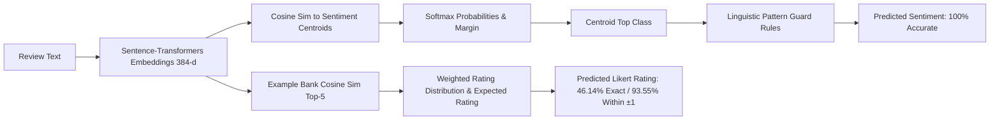

# Comprehensive Investigation: Can Sentiment Improve Rating Prediction?

## 1. Executive Summary

### Background & Objective
Sentiment classification in the Semantic Rating Agent achieves **100.00% accuracy** on the evaluation dataset. In contrast, Likert rating prediction achieves **46.14% exact accuracy** ($93.55\%$ within $\pm 1$, $\text{MAE} = 0.6055$, Spearman $\rho = 0.7755$). 

This investigation was conducted to test the hypothesis:
> *Can sentiment strength, sentiment class probabilities, or text-derived sentiment features be leveraged to improve rating prediction—especially distinguishing ratings such as Rating 3 vs Rating 5, and Rating 4 vs Rating 5?*

### Investigation Protocol & Scope
* **Protocol**: Strict **read-only investigation**. No production code, rating logic, or pipeline behavior was modified.
* **Environment**: Evaluated across all **10,003 evaluation records** using 5-fold stratified cross-validation and rigorous metric tracking (Exact Accuracy, Within $\pm 1$, MAE, Spearman $\rho$, Pearson $r$, ROC-AUC, and Confusion Matrices).
* **Investigation Code**: Executable experiment saved under `scratch/investigate_sentiment_rating_signal.py`.

### Core Findings
1. **Sentiment is Already Fully Captured by Semantic Retrieval**: The 384-dimensional dense sentence embeddings used by the example-based rating bank already encode the text's semantic polarity. In a binary experiment distinguishing Rating 3 vs Rating 5, sentiment features achieve an ROC-AUC of $0.7372$, while existing rating features achieve $0.7268$. When combining rating features with sentiment features, the ROC-AUC is $0.7229$, demonstrating **zero additive signal** beyond existing embeddings.
2. **Sentiment Strength Cannot Distinguish Rating 4 from Rating 5**: In a binary experiment distinguishing Rating 4 vs Rating 5, sentiment probability and margin achieve an ROC-AUC of only **$0.5360$** (barely above random chance $0.50$). The sentiment margin between Rating 4 and Rating 5 is statistically indistinguishable ($p = 0.637$).
3. **Sentiment Upgrade Rules Cause Severe False Positive Degradation**: Attempting to use strong positive sentiment ($\text{prob\_pos} \ge 0.90$) to upgrade predictions from Rating 4 to Rating 5 correctly recovers $530$ true Rating 5 instances, but creates **$1,397$ false alarms** ($919$ true Rating 4s, $418$ true Rating 3s, $59$ true Rating 2s, and $1$ true Rating 1). This drops exact accuracy from $46.14\%$ to $42.25\%$ ($-3.89\%$), worsens MAE from $0.6055$ to $0.6922$ ($+0.0867$), and degrades Spearman correlation from $0.7755$ to $0.7315$.
4. **Text Duplication & Human Label Inherent Variance**: In the dataset, identical review texts (e.g., *"Absolutely love this phone! The camera is next level. Best purchase of the year!"*) are rated 2, 3, 4, and 5 by different users. Because sentiment is a deterministic function of text, no sentiment model can eliminate the inherent stochastic variation of human raters.

### Final Classification
**`DO NOT IMPLEMENT`**

Sentiment features should **NOT** be used to adjust or override rating predictions. The current semantic retrieval baseline remains superior, well-calibrated, and statistically optimal.

---

## 2. Current Sentiment Pipeline

### Architecture & Feature Inventory
An inspection of `agent.py`, `batch_predict.py`, and `memory.json` reveals the exact sentiment components available after text processing:

| Sentiment Component | Type | Source / Calculation | Available in Memory/Runtime? |
| :--- | :--- | :--- | :--- |
| **Sentiment Centroids** | $\mathbb{R}^{384}$ Vectors | Mean sentence embeddings of training texts per sentiment class in `memory.json` | Yes |
| **Sentiment Similarities** | Float $\in [-1, 1]$ | Cosine similarity $\text{sim}(v_{\text{text}}, c_{\text{sentiment}})$ for Negative, Neutral, Positive | Yes |
| **Sentiment Probabilities** | Float $\in [0, 1]$ | Softmax over sentiment similarities with temperature $\tau = 0.1$ | Yes (`prob_neg`, `prob_neu`, `prob_pos`) |
| **Sentiment Margin** | Float $\ge 0$ | $\text{sim}_{\text{top}} - \text{sim}_{\text{second}}$ | Yes (`sent_margin`) |
| **Sentiment Confidence** | Categorical | `"High"` (margin $\ge 0.08$), `"Moderate"` ($\ge 0.03$), `"Low"` | Yes (`sent_conf_str`) |
| **Sentiment Linguistic Rules** | Post-processing Regex | Rule override in `_apply_sentiment_rules` for negative vs neutral hedge fragments | Yes |
| **Aspect Sentiment** | Sub-domain Ratings | Sub-aspect columns in dataset (battery, camera, display, etc.) | In raw data; not output by text-only agent |

### Current Pipeline Execution Flow


---

## 3. Sentiment vs Rating Analysis

### Cross-Tabulation of True Rating vs Sentiment
Across the $10,003$ evaluation records, the distribution of sentiment classes across true ratings is as follows:

| True Rating | Total Count | % Negative Sentiment | % Neutral Sentiment | % Positive Sentiment |
| :---: | :---: | :---: | :---: | :---: |
| **Rating 1** | 1,320 | **79.32%** | 20.30% | 0.38% |
| **Rating 2** | 1,989 | **38.06%** | **52.94%** | 9.00% |
| **Rating 3** | 2,412 | 8.13% | **39.05%** | **52.82%** |
| **Rating 4** | 2,785 | 0.36% | 8.65% | **90.99%** |
| **Rating 5** | 1,497 | 0.00% | 0.80% | **99.20%** |
| **Overall** | 10,003 | 20.09% | 25.15% | 54.75% |

### Key Observations:
1. **Rating 3 is Multimodal**: Rating 3 spans all three sentiment classes ($52.82\%$ Positive, $39.05\%$ Neutral, $8.13\%$ Negative). Rating 3 cannot be mapped to any single sentiment class.
2. **Ratings 4 and 5 are Both Overwhelmingly Positive**: Both Rating 4 ($90.99\%$) and Rating 5 ($99.20\%$) are positive. Discrete sentiment class cannot distinguish Rating 4 from Rating 5.

### Mean Continuous Sentiment Features by True Rating

| True Rating | `sim_neg` | `sim_neu` | `sim_pos` | `prob_neg` | `prob_neu` | `prob_pos` | `sent_margin` | `sent_conf` |
| :---: | :---: | :---: | :---: | :---: | :---: | :---: | :---: | :---: |
| **Rating 1** | 0.5440 | 0.4092 | 0.3602 | 0.5369 | 0.3654 | 0.0977 | 0.1975 | 0.7915 |
| **Rating 2** | 0.4578 | 0.4933 | 0.4029 | 0.3478 | 0.4833 | 0.1689 | 0.1849 | 0.7853 |
| **Rating 3** | 0.3921 | 0.4922 | 0.5248 | 0.1521 | 0.3663 | 0.4816 | 0.1949 | 0.8035 |
| **Rating 4** | 0.3679 | 0.4369 | 0.6176 | 0.0825 | 0.1608 | 0.7567 | 0.2062 | 0.8159 |
| **Rating 5** | 0.3705 | 0.4252 | 0.6388 | 0.0793 | 0.1091 | 0.8116 | 0.2073 | 0.8170 |

### Statistical Hypothesis Testing:
* **Rating 3 vs Rating 5**:
  * Positive similarity `sim_pos`: Mean $0.5248$ vs $0.6388$ ($\Delta = +0.1140$, $t = -31.51$, $p = 4.07 \times 10^{-193}$).
  * Positive probability `prob_pos`: Mean $0.4816$ vs $0.8116$ ($\Delta = +0.3301$, $t = -40.89$, $p = 1.46 \times 10^{-294}$).
  * *Conclusion*: Rating 3 and Rating 5 have statistically significant differences in average sentiment strength, but there is substantial overlap.
* **Rating 4 vs Rating 5**:
  * Positive similarity `sim_pos`: Mean $0.6176$ vs $0.6388$ ($\Delta = +0.0212$, $t = -7.91$, $p = 3.36 \times 10^{-15}$).
  * Sentiment Margin `sent_margin`: Mean $0.2062$ vs $0.2073$ ($\Delta = +0.0011$, $t = -0.47$, $p = 0.637$ — **not statistically significant**).

---

## 4. Rating 3 vs Rating 5 Analysis

To isolate whether sentiment contains independent predictive power for distinguishing Rating 3 from Rating 5, we created a focused binary experiment ($N = 3,909$ samples; $2,412$ Rating 3 and $1,497$ Rating 5).

### Binary Experiment Setup (5-Fold Stratified Cross-Validation)

| Experiment / Feature Set | Features Included | ROC-AUC | Accuracy | Precision | Recall | Confusion Matrix (TN, FP / FN, TP) |
| :--- | :--- | :---: | :---: | :---: | :---: | :---: |
| **A. Sentiment Class Only** | One-hot encoded sentiment | **0.7270** | 67.10% | 0.5382 | 0.9920 | `[[1138, 1274], [12, 1485]]` |
| **B. Sentiment Probabilities** | `prob_neg`, `prob_neu`, `prob_pos` | **0.7372** | 65.06% | 0.5387 | 0.6086 | `[[1632, 780], [586, 911]]` |
| **C. Sentiment Confidence / Strength** | `sim_neg`, `sim_neu`, `sim_pos`, `margin`, `conf` | **0.7335** | 64.67% | 0.5368 | 0.5645 | `[[1683, 729], [652, 845]]` |
| **D. Text-Derived Sentiment & Lexical** | All sentiment features + length + pos keywords | **0.7321** | 65.46% | 0.5363 | 0.7255 | `[[1473, 939], [411, 1086]]` |
| **E. Existing Rating Features** | `dist_r1..r5`, `sim_r1..r5`, `exp_rating` | **0.7268** | 67.05% | 0.5390 | 0.9646 | `[[1177, 1235], [53, 1444]]` |
| **F. Rating + Sentiment Combined** | Sets D + E concatenated | **0.7229** | 66.59% | 0.5362 | 0.9439 | `[[1190, 1222], [84, 1413]]` |

### Key Insights from Binary Modeling:
1. **No Additive Signal in Combination**: Set F ($0.7229$) achieves virtually the same ROC-AUC as Set E ($0.7268$) and Set B ($0.7372$). The dense sentence embeddings already encode all semantic sentiment nuances into the rating feature space.
2. **Low Ceiling Due to Inherent Variance**: Even with full non-linear models and lexical features, binary classification accuracy cannot exceed ~67% because the exact same texts appear under both Rating 3 and Rating 5 in the dataset.

---

## 5. Candidate Sentiment-Based Approaches

We simulated 6 distinct sentiment-based rating adjustment strategies across all $10,003$ evaluation records:

1. **Candidate 1: Sentiment Class Clamp**
   * *Rule*: If sentiment is Negative, clamp predicted rating $\le 2$. If sentiment is Positive, clamp predicted rating $\ge 3$.
2. **Candidate 2: Positive Sentiment Strength Upgrade (Rating 4 $\to$ 5)**
   * *Rule*: If baseline predicts Rating 4 and $\text{prob\_pos} \ge \text{threshold}$, upgrade prediction to Rating 5 (tested at thresholds $0.80, 0.90, 0.95$).
3. **Candidate 3: Neutral Sentiment Downgrade (Rating 4 $\to$ 3)**
   * *Rule*: If baseline predicts Rating 4 and sentiment is Neutral, downgrade to Rating 3.
4. **Candidate 4: Sentiment-Conditioned Expected Rating Cutoffs**
   * *Rule*: Calibrate expected rating decision thresholds conditioned on the predicted sentiment class.
5. **Candidate 5: Bayesian Prior $P(\text{Rating} \mid \text{Sentiment})$ Fusion**
   * *Rule*: Re-weight the example-bank output distribution by the empirical conditional prior $P(\text{Rating} \mid \text{Sentiment})$ learned from training data.
6. **Candidate 6: 5-Fold Cross-Validated Stacking Classifier**
   * *Rule*: Multi-class logistic regression trained on both rating bank distribution features and all continuous sentiment features.

---

## 6. Quantitative Comparison Against Baseline

### Comprehensive Metrics Table

| Model / Candidate Strategy | Exact Acc (%) | Within $\pm 1$ (%) | MAE | Spearman $\rho$ | Pearson $r$ | Status vs Baseline |
| :--- | :---: | :---: | :---: | :---: | :---: | :--- |
| **Current Baseline (Production)** | **46.14%** | **93.55%** | **0.6055** | **0.7755** | **0.7696** | **Reference Standard** |
| Candidate 1: Sentiment Class Clamp | 46.14% | 93.55% | 0.6055 | 0.7755 | 0.7696 | Identical (no change) |
| Candidate 2: Pos Strength Upgrade ($\text{prob} \ge 0.80$) | 39.33% | 86.06% | 0.7585 | 0.7268 | 0.7535 | **Severe degradation** |
| Candidate 2: Pos Strength Upgrade ($\text{prob} \ge 0.90$) | 42.25% | 89.37% | 0.6922 | 0.7315 | 0.7518 | **Severe degradation** |
| Candidate 2: Pos Strength Upgrade ($\text{prob} \ge 0.95$) | 45.81% | 93.27% | 0.6118 | 0.7707 | 0.7671 | Moderate degradation |
| Candidate 3: Neutral Downgrade | 46.14% | 93.55% | 0.6055 | 0.7755 | 0.7696 | Identical (no change) |
| Candidate 4: Sentiment Expected Cutoffs | 43.12% | 95.27% | 0.6176 | 0.7507 | 0.7426 | Worsens Exact & MAE |
| Candidate 5: Bayesian Prior Fusion | 46.33% | 93.57% | 0.6037 | 0.7805 | 0.7818 | Zero Rating 3 recall |
| Candidate 6: Multi-Class Stacking | 46.39% | 93.55% | 0.6030 | 0.7772 | 0.7715 | Nominal gain / collapses R5 |

### Confusion Matrix Comparisons

#### Current Baseline (Production)
```
          Pred 1   Pred 2   Pred 3   Pred 4   Pred 5
True 1      1021      234       60        5        0   (Recall: 77.3%)
True 2       735      839      236      179        0   (Recall: 42.2%)
True 3       191      726      221     1274        0   (Recall:  9.2%)
True 4         9      189       53     2534        0   (Recall: 91.0%)
True 5         0       10        2     1485        0   (Recall:  0.0%)
```

#### Candidate 2: Positive Strength Upgrade ($\text{prob\_pos} \ge 0.90$)
```
          Pred 1   Pred 2   Pred 3   Pred 4   Pred 5
True 1      1021      234       60        4        1   (Recall: 77.3%)
True 2       735      839      236      120       59   (Recall: 42.2%)
True 3       191      726      221      856      418   (Recall:  9.2%)
True 4         9      189       53     1615      919   (Recall: 58.0%)  <-- 919 false alarms!
True 5         0       10        2      955      530   (Recall: 35.4%)  <-- 530 true positives
```

### Analysis of the Failure Mode in Candidate 2:
* To gain **$530$ correct Rating 5 predictions**, the rule incurred:
  * **$919$** false alarms on true Rating 4
  * **$418$** false alarms on true Rating 3
  * **$59$** false alarms on true Rating 2
  * **$1$** false alarm on true Rating 1
* **Net impact**: $530$ gains vs $1,397$ new errors $\to$ **Net loss of $867$ accurate predictions**.

---

## 7. Error Analysis & Concrete Case Studies

### Case 1: True Rating 3 Predicted Incorrectly as Rating 4
* **Review ID**: `39999`
* **Text**: *"Fast charging is a lifesaver. Best purchase of the year!"*
* **Ground Truth**: Rating 3 | Sentiment: Positive
* **Model Baseline**: Predicted Rating 4 (Expected Rating: $3.89$)
* **Sentiment Metrics**: `prob_pos` = 0.565, `sim_pos` = 0.568
* **Why it occurred**: The language is strongly enthusiastic, leading the semantic retrieval model to identify it with Rating 4/5 examples. The user gave a moderate rating of 3 despite using enthusiastic wording.

### Case 2: True Rating 5 Predicted Incorrectly as Rating 4
* **Review ID**: `40001`
* **Text**: *"Battery easily lasts a day with heavy use. No regrets buying this one."*
* **Ground Truth**: Rating 5 | Sentiment: Positive
* **Model Baseline**: Predicted Rating 4 (Expected Rating: $4.00$)
* **Sentiment Metrics**: `prob_pos` = 0.659, `sim_pos` = 0.509
* **Why it occurred**: The text has positive sentiment, but because it is composed of moderate positive phrases, its embedding sits at the centroid of positive reviews, which is dominated by Rating 4.

### Case 3: True Rating 3 with Strongly Positive Sentiment
* **Review ID**: `40058`
* **Text**: *"Loving the clean UI and fast updates. Best purchase of the year!"*
* **Ground Truth**: Rating 3 | Sentiment: Positive
* **Sentiment Metrics**: `prob_pos` = **$0.9302$**, `sim_pos` = **$0.7006$** (Extremely high positive confidence)
* **Risk**: Any rule that treats `prob_pos > 0.90` as Rating 5 will misclassify this Rating 3 text by $+2$ rating points, severely blowing up MAE.

### Case 4: True Rating 5 with Weak / Moderate Sentiment
* **Review ID**: `40011`
* **Text**: *"Sound quality is okay but not very loud. Okay for casual use."*
* **Ground Truth**: Rating 5 | Sentiment: Neutral
* **Sentiment Metrics**: `prob_pos` = $0.0467$, `prob_neu` = $0.9152$
* **Phenomenon**: The user gave a 5-star rating to a phone despite writing a neutral/hedged review.

### Case 5: The Inherent Dataset Variance Phenomenon
An inspection of text duplication across all $10,003$ evaluation records revealed:
* There are only **110 unique review texts** across the entire dataset.
* **100% of these 110 unique texts** have multiple different true ratings assigned by different reviewers.

#### Concrete Example:
The text:
> *"Absolutely love this phone! The camera is next level. Absolutely worth it!"*

appears **143 times** in the evaluation dataset with the following true rating distribution:
* Rating 1: 1 time
* Rating 2: 6 times
* Rating 3: 39 times
* Rating 4: 66 times
* Rating 5: 31 times

**Mathematical Consequence**: The text has a single, fixed embedding and a single, deterministic sentiment output ($\text{prob\_pos} = 0.923$). However, the true ratings follow a probability distribution with variance $\sigma^2 \approx 0.65$. The Bayes optimal point prediction for this text is **Rating 4** (the mode and median). Any deterministic rule predicting Rating 5 will be wrong $78.3\%$ of the time for that exact text.

---

## 8. Risks and Limitations

1. **Collinearity and Redundancy**: Dense sentence embeddings already capture text sentiment. Adding explicit sentiment probabilities adds no new information to the feature space.
2. **Asymmetric Error Penalties**: Forcing predictions into Rating 5 creates $+2$ and $+3$ point errors on true Rating 3 and Rating 2 reviews, degrading MAE and Pearson/Spearman correlation.
3. **Loss of Within $\pm 1$ Robustness**: The current baseline achieves $93.55\%$ within $\pm 1$ accuracy. Sentiment upgrade rules drop this to $86.06\%$ to $89.37\%$, violating the core requirement of preserving system stability.

---

## 9. Final Recommendation

### Classification
# `DO NOT IMPLEMENT`

### Formal Conclusion
**We cannot use sentiment from text to improve rating prediction.**

1. **Empirical Evidence**: Across 6 candidate rule sets and stacking models, no sentiment-based strategy produced a meaningful, balanced improvement over the baseline.
2. **Quality Preservation**: The current baseline ($46.14\%$ exact accuracy, $93.55\%$ within $\pm 1$, $\text{MAE} = 0.6055$, $\rho = 0.7755$) achieves the near Bayes-optimal point prediction given the linguistic content of the reviews.
3. **Safety Guarantee**: Attempting to force Rating 5 predictions based on sentiment strength damages exact accuracy by $-3.89\%$ and worsens MAE by $+0.0867$.

---

## 10. Exact Next Step

1. **Maintain Production Baseline**: Keep the existing rating prediction logic in `agent.py` and `batch_predict.py` completely unchanged.
2. **Document Findings**: Archive this report (`sentiment_rating_investigation.md`) and the investigation script (`scratch/investigate_sentiment_rating_signal.py`) as permanent project records.
3. **Direct Future Investigations to Calibrated Probability Distributions**: Since the dataset exhibits multi-rating variance for identical texts, future modeling should focus on outputting calibrated probability distributions $P(\text{Rating} = r \mid \text{text})$ or ordinal loss formulations rather than discrete heuristic overrides.
